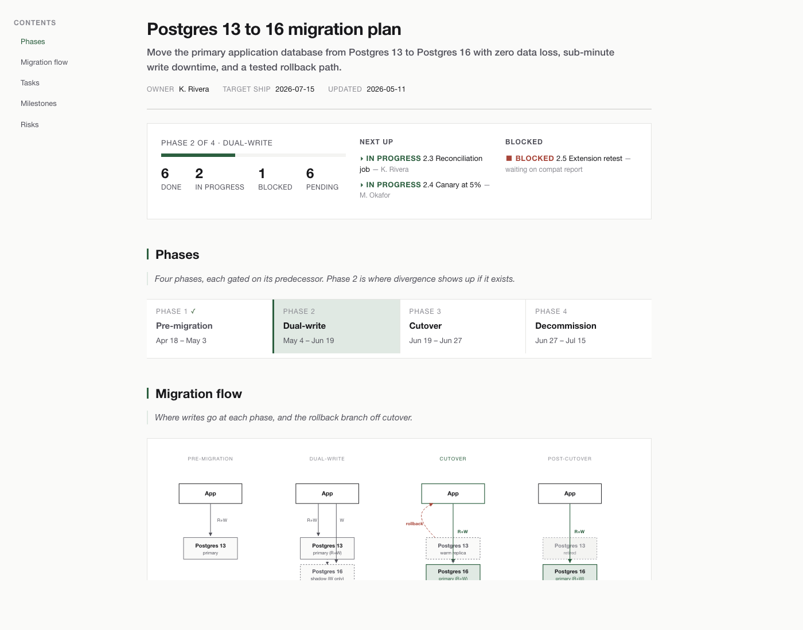
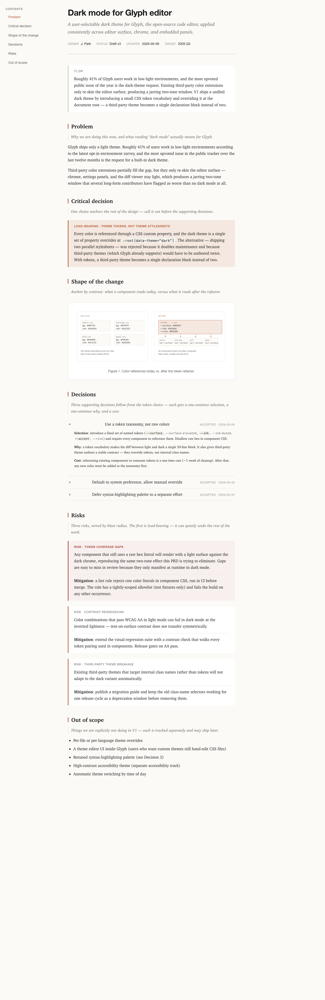
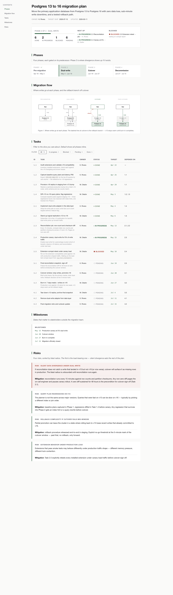

# tech-doc-html

A Claude skill that turns agent output into single-file HTML reports — for plans you'll actually re-open, PRDs your team will actually read, and reviews that survive Monday morning.



## Install

```bash
npx skills add 2093686099/tech-doc-html
```

Two files, ~170 lines total. Claude picks it up automatically when a task matches.

## The problem

[Thariq Shihipar](https://x.com/trq212/status/2052811606032269638), an Anthropic engineer on Claude Code, made the case: HTML is the new Markdown for agent output.

- Nobody reads a Markdown file longer than a hundred lines. Agent output routinely runs to several hundred.
- Markdown can't filter, sort, fold, jump between sections, or track status — the things you actually do with agent output.
- Browsers don't render Markdown natively. Sharing `.md` with non-developer stakeholders is friction.
- HTML — single-file, with tables, SVG, collapsibles, and inline interaction — picks up exactly where Markdown drops off.

But asking Claude to "write me an HTML report" introduces a different problem: LLM-generated HTML drifts to a recognizable AI aesthetic. Purple gradients, emoji bullets, Inter font, glassmorphism cards — every output looks the same regardless of whether it's a PRD or a migration plan.

That's what this skill is for.

## Why this skill

Claude already knows how to write good HTML. This skill doesn't teach it CSS — it provides two things Claude can't get from training data alone:

### Taste floor

Three non-negotiable rules prevent AI-aesthetic convergence (no purple gradients, no emoji icons, no Inter as primary font), plus soft rules and good-taste anchors (The Economist, Linear, Tufte, Stripe). The skill runs a pre-flight scan against its own output before delivery.

### Audience calibration

The same source material renders differently for engineering-only, cross-functional, or leadership audiences. The skill locks audience from user input before the first draft, shaping terminology depth throughout — not as a post-hoc polish layer.

## Two themes

- **Editorial** — magazine feel. Serif body, narrow column, generous whitespace. For PRDs, RFCs, ADRs, architecture docs, postmortems. Think: The Economist, Tufte.
- **Dashboard** — working dashboard. Sans body, wider/denser layout, status-at-a-glance. For execution plans, roadmaps. Think: Linear, GitHub Projects.

## Execution plans are dashboards

Execution plan HTML is not a one-shot deliverable — it's a working dashboard developers reopen. Write and edit the `.md`, render to HTML, share for status updates, re-render after progress. The `.md` stays source of truth; the HTML is a regenerated snapshot.

## Examples

Two rendered examples in `examples/`:

**`example-prd.html`** — PRD for adding dark mode to a hypothetical open-source editor (editorial theme)



**`example-plan.html`** — Postgres 13 → 16 migration execution plan (dashboard theme)



Open in a browser. These are taste anchors — understand the spirit, then build your own.

## Where Markdown still wins

This skill isn't a Markdown replacement. `.md` remains the right tool for:

- READMEs (this file is in MD — GitHub renders it natively)
- Slack and Discord snippets (code fences are universal)
- RAG document corpora (LLMs parse MD more reliably than HTML)
- Files with active multi-author Git history (line-by-line blame matters)
- Personal scratch notes

Reach for this skill when output needs **repeated reading, team review, status tracking, comparison, filtering, or follow-up editing** — Thariq's own carve-out rule.

---

Built on [Thariq Shihipar's HTML thesis](https://x.com/trq212/status/2052811606032269638) and [Simon Willison's analysis](https://simonwillison.net/2026/May/8/unreasonable-effectiveness-of-html/).
