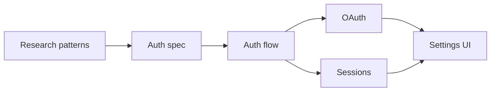
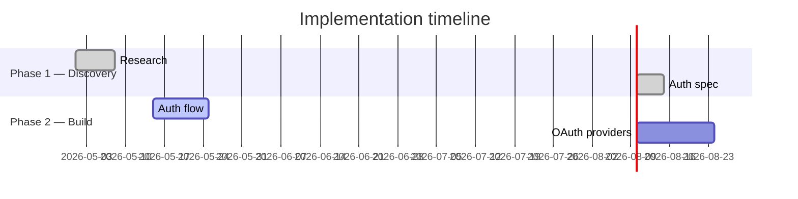

# Document type: Execution plan / implementation plan

**Theme:** `dashboard` (always). This document type is the primary use case for the dashboard theme.

**Accent:** forest (default) or terracotta if the user prefers consistency across docs.

This document type has a dedicated workflow because it's read repeatedly, often while AI is doing the work. It's a live tracking artifact, not a one-shot deliverable.

## The tracking artifact workflow

Crucial context for how this document gets used:

```
┌─────────────────┐         ┌─────────────────┐         ┌─────────────────┐
│  plan.md        │  render │  plan.html      │  read   │  developer +    │
│  (source        ├────────►│  (dashboard,    ├────────►│  team / leader  │
│   of truth)     │         │   snapshot)     │         │                 │
└────────▲────────┘         └─────────────────┘         └────────┬────────┘
         │                                                        │
         │  update status as work progresses                      │
         │  (developer or Claude Code edits MD)                   │
         └────────────────────────────────────────────────────────┘
```

Implications for the renderer:

1. **Speed matters.** Re-rendering should be fast (it is — single file, no build).
2. **Status changes between renders must be visible.** Don't hide status; put it everywhere relevant.
3. **"Next up" must be obvious.** When the developer opens the HTML, they should immediately see what to delegate next without reading the whole doc.
4. **"What's blocked" must be obvious.** Same reasoning — surface it.
5. **The HTML is an honest snapshot.** Don't fabricate optimistic-looking status. If 5 tasks are blocked, show 5 tasks blocked.

## Information hierarchy

Top of document, in order:

1. **Title** (H1, sans, weight 700)
2. **One-line goal subtitle** — what shipping looks like (sans, weight 500, ink-muted)
3. **Metadata row**: owner, target ship date, related PRD link, last-updated
4. **Status glance** — the dashboard theme's flagship pattern (see `theme-dashboard.md`):
   - Progress bar with overall % and X/Y tasks-done count
   - Current phase highlighted
   - "Next up" panel: 1–3 tasks ready to start (status=pending, dependencies satisfied)
   - "Blocked" panel: any blocked tasks with the blocker named
5. **Phase strip** — visual timeline of major phases

After the glance, the document continues with:

6. **Mermaid dependency graph** (optional, if source describes dependencies)
7. **Task table** — full list, filterable if >10 tasks
8. **Mermaid gantt** (optional, if source has specific dates)
9. **Milestones** — distinct from tasks; the dates that matter
10. **Risks** — collapsible if long; warning callouts if short

## Source MD structure expectations

For the renderer to produce a good dashboard, the MD should encode tasks in a structured way. If the source uses informal prose like "Alice is working on auth, Bob will do OAuth after", the skill should ask the user to add structure, OR fall back to rendering as prose.

Recommended source MD task structure (YAML-ish or table-style — both work):

**Option A: YAML-like list**
```markdown
## Phase 2 · Build

- id: 2.1
  task: Implement auth flow
  owner: Alice
  status: in-progress
  target: 2026-05-24
  depends: 1.3

- id: 2.2
  task: Wire OAuth providers
  owner: Bob
  status: pending
  target: 2026-06-07
  depends: 2.1
```

**Option B: Markdown table** (also fine — usually easier to maintain)
```markdown
## Phase 2 · Build

| ID | Task | Owner | Status | Target | Depends on |
|----|------|-------|--------|--------|------------|
| 2.1 | Implement auth flow | Alice | In progress | 2026-05-24 | 1.3 |
| 2.2 | Wire OAuth providers | Bob | Pending | 2026-06-07 | 2.1 |
```

**Status vocabulary** (must match):
- `done` — completed
- `in-progress` / `active` — being worked on right now
- `pending` — not started, no blocker
- `blocked` — not started, has unmet dependency or external blocker
- `at-risk` — in progress but slipping

## Variant: tasks live in GitLab / GitHub issues

A common workflow: the team uses GitLab or GitHub issues as the actual task tracker, and the MD execution plan is a *coordination layer* on top of them — phase grouping, dependency annotation, and a single page where leadership can read status without clicking into 20 issues.

In this variant, each MD task row carries an issue reference (`#42`), and the issue's status is the source of truth. The MD's `status` field is a *last-known snapshot* with an "as of" timestamp.

### Source MD shape

```markdown
## Phase 0 · Pre-work

| ID | Task | Issue | Owner | Status | Target | Depends on |
|----|------|-------|-------|--------|--------|------------|
| f0 | Verify legacy endpoint reachable on new server image | [#18](https://gitlab.example.com/group/proj/-/issues/18) | Alice | ready-for-agent | 2026-05-15 | — |
| f1 | Implement signed URL helper for storage backend | [#19](.../-/issues/19) | Alice | ready-for-agent | 2026-05-15 | — |
| f3 | Three-step DB migration + staging dry-run + rollback drill | [#21](.../-/issues/21) | Alice | ready-for-human | 2026-05-22 | f0 |

> Snapshot as of 2026-05-11 14:30 UTC — `glab issue list --label module::backend`
```

The "Snapshot as of" line is required — it tells the reader the HTML is a frozen view, not live state. Re-render to update.

### Status label mapping

If the project uses scoped labels (`status::*`), map them into the skill's vocabulary at render time:

| GitLab/GitHub label | Skill status | Notes |
|---|---|---|
| `closed` (issue state) | `done` | Issue state takes precedence over labels |
| `status::in-progress` | `in-progress` | |
| `status::blocked` | `blocked` | Surface the blocker reason from the issue body if available |
| `status::at-risk` | `at-risk` | |
| `status::ready` / `status::ready-for-agent` | `pending` | Ready to be picked up |
| `status::ready-for-human` | `pending` | Ready, but needs human action (HITL) — render the row with a small "(HITL)" tag in the Owner column so the developer doesn't try to delegate it to an agent |
| open, no `status::*` label | `pending` | Default |

Some teams use richer triage states (`ready-for-agent` vs `ready-for-human` distinguishes who picks the work up next). The skill's vocab collapses these into `pending` — but preserve the distinction visually with a small tag, because it changes the "Next up" delegation decision.

### Rendering the issue link

The Issue column renders the `#N` as a real `<a href="...">` to the issue. Open in new tab (`target="_blank" rel="noopener"`). The link gets the same accent color as other links, but use a smaller monospace font to make it scannable:

```css
.issue-ref { font-family: var(--font-mono); font-size: var(--fs-small);
             color: var(--accent); white-space: nowrap; }
```

### Optional: glab-driven status injection (advanced)

For teams that want the HTML to reflect live GitLab state at render time, the skill can optionally shell out to `glab issue view <N> --output json` per task before rendering, and override the MD's `status` field with the issue's current labels. This costs ~200ms per issue and requires `glab` auth.

This breaks the "single-file static artifact" property a little (the HTML is now *generated from a live query*, not from MD alone), so it's an opt-in: the source MD should declare it explicitly with `live_status: true` in frontmatter, and the rendered HTML should include a "Live status as of <timestamp>" line that's clearly more recent than the MD's `updated` field.

Skip live mode for the default workflow. The MD-snapshot approach is honest and sufficient — re-rendering after manually syncing MD takes 5 seconds.

### What stays the same

Everything else from this document still applies in the GitLab variant: status glance computation, phase strip, Next up, Blocked, filter bar, Mermaid dependency graph. The MD task table is still the input — issues just *back* the status field.

## Rendering details

### Status glance computation

The skill must compute these values from the task list (don't ask the user to maintain them separately — that's a sync hazard):

```
total_tasks = count(all tasks)
done = count(status == done)
in_progress = count(status == in-progress)
blocked = count(status == blocked)
pending = count(status == pending)
percent = done / total_tasks × 100

current_phase = the phase containing at least one in-progress task
                (or the next phase after the last done-only phase)

next_up = up to 3 tasks where:
  status == pending
  AND all tasks listed in `depends` are status == done
  ordered by phase order, then by id

blocked_with_reason = all tasks where status == blocked,
  showing what they depend on (or a free-text blocker note from source)
```

If `next_up` is empty but there are pending tasks, that means everything is blocked on something — surface that explicitly: "All pending tasks are blocked on dependencies."

### Standing items vs blocked — scope-honest counts

A common confusion: the source MD has a "Standing items" / "Follow-up issues" section listing things that exist in the team's tracker but are **outside the current plan's scope** — deferred to a later milestone, or being handled by an unrelated workflow. These items often carry `status::blocked` in the issue tracker, because the team uses "blocked" loosely to mean "not being worked on right now".

The skill must NOT roll these into the status-glance `Blocked` count. A leader scanning the dashboard sees `Blocked: 2` and assumes 2 things are stopping the release. If those 2 items are actually `#25` and `#26` deferred-from-this-PR follow-ups, the panel is lying.

Rendering rule:
- The `Blocked` count in progress-stats counts **only tasks inside the current plan's scope** with status `blocked` (something is stopping them from running *that the plan owns*).
- Standing items / out-of-scope follow-ups render in a **separate panel** — header like "Standing · not blocking [PR1]" or "Standing follow-up". Each item uses `.status-standing` badge (see `core-tokens.md`), not `.status-blocked`.
- If the source MD has no "Standing items" section, skip the panel.
- Same rule for `Pending`, `In progress`, and the percent-complete bar: count only what's in scope.

This honors the "honest snapshot" principle below: a leader's 30-second read of the dashboard should match what's actually happening, not include items the plan isn't responsible for.

### Phase strip

Mark phases:
- `done` if all its tasks are done
- `active` (highlight with accent-soft background) if it contains in-progress tasks
- otherwise upcoming (plain)

### Task table

Use `.task-table` from `theme-dashboard.md`. Columns: ID, Task, Owner, Status, Target, Depends on.

If >10 tasks: add filter buttons (All / In progress / Blocked / Pending / Done) per `interactivity.md`. Default to "All".

If >20 tasks AND >3 phases: also wrap each phase in a `<details>` collapsible. Open the current phase, collapse done phases, collapse upcoming phases. See `interactivity.md` "Collapse-by-phase".

Row hover highlights help when scanning a long table.

#### Dual-layer task name

Apply `readability.md` Pattern 4 — Dual-layer task / item names. The full pattern definition (including the reshape rule and the canonical Langfuse example) is there; this section covers the task-table integration.

Issue-backed task names are often copy-pasted from issue titles — long, dense, full of variable names, written for the engineer who'll do the work. A leader scanning the table can't parse them. Trigger this when the task name is > 60 characters, or contains ≥ 3 inline `<code>` blocks, or both.

Inside a task-table cell, the markup is:

```html
<td>
  <span class="task-name">Verify legacy endpoint reachable on v3 server</span>
  <span class="task-hint">Smoke-test 4 namespaces for 200 OK — single firewall for this phase.</span>
</td>
```

For short, already-readable task names (`Canary 5% rollout`, `Add login button`), skip the hint — it would add noise without value. The trigger is the source title's complexity, not a mechanical rule.

#### Framing sentence below each phase H2

The H2 for each phase should be followed by a one-sentence framing line that answers: *what does this phase do for the project, and what's the risk shape?* Apply `readability.md` Pattern 1.

Examples (generic templates, not copy-paste):

- *"These N items are not in the main PR — but the main PR can't start without them. Item X is the single firewall: if it fails, the whole sequence reshuffles."*
- *"This is where the actual code lands — feature work, integration, the visible delta. None of these are decomposed into issues yet."*
- *"Rollout in stages. Each stage gates on the previous stage's monitoring window. Roll back on any threshold breach."*

#### Filter button labels — semantic over mechanical

When the task table has multiple "pending" sub-states (e.g. `ready-for-agent` / `ready-for-human` / `waiting-on-dependency`), the filter button labels should reflect **what the reader can do with each subset**, not the raw label name:

| Mechanical label | Semantic label |
|---|---|
| Pending | Pending (queued) — or, more precise: "Queued (deps unmet)" |
| Ready-for-agent | Agent-ready / 可派 Agent |
| Ready-for-human | Human-ready / 需 Human |
| Blocked | Blocked |
| Done | Done |

The semantic form tells the reader "if I click this filter, I see tasks I can delegate to an agent right now." The mechanical form forces the reader to translate.

When the source's status vocabulary is in English and the audience is bilingual, label in both ("Agent-ready 可派 Agent"). When the audience is monolingual, pick one.

### Dependency graph

If the source has explicit `depends` fields, generate a Mermaid `graph LR`:



If there are no explicit dependencies, skip the graph — don't invent them.

For >15 tasks, the graph gets messy. Consider showing only inter-phase or critical-path dependencies. Or skip the graph and rely on the table's "Depends on" column.

### Gantt chart

Only generate if every task has a specific date (not "Q3", not "TBD"). Generate Mermaid gantt grouped by phase:



Use Mermaid's `done`/`active`/`crit` markers to match task status.

### Milestones aside

Separate from tasks (milestones are dates, not work):

```html
<aside class="callout">
  <div class="callout-label">Milestones</div>
  <ul class="milestones-list">
    <li><span class="date">May 24</span> Auth flow merged to main</li>
    <li><span class="date">Jun 7</span> Internal beta opens</li>
    <li><span class="date">Jul 20</span> GA</li>
  </ul>
</aside>
```

### Risks

Short risks (≤4 items): each as `.callout.callout-warn`. Use the statement / mitigation skeleton — see `readability.md` Pattern 6.

When one risk is the load-bearing 0-day risk, promote it to `.callout-critical` — at most one per list. See `readability.md` Pattern 7.

Long risks (>4 items): use `<details>` collapsibles, one per risk. Default closed. The same statement/mitigation skeleton applies inside.

## Interactivity decisions

- **TOC** with scroll-spy: always
- **Status filter on task table**: if >10 tasks
- **Collapse-by-phase**: if >20 tasks AND >3 phases
- **Per-risk collapsible**: if >4 risks
- **Tabs**: no — execution plans flow linearly
- **Search**: no — Ctrl+F is fine

## What "honest snapshot" means

A few rules to enforce:

- Don't paraphrase status. If source says "in-progress", render as "In progress", not "On track" or "Going well".
- If a task has been "in-progress" past its target date, mark it `at-risk` automatically in the render, with a small note. (But check that the source actually has dates; if dates are vague, don't compute risk.)
- If a task has TBD owner or TBD date, render the gap visibly. Don't fill in with "—" silently.
- If a task is `done` but its dependents are still `pending`, that's fine — no warning needed.
- If a task is `pending` but its dependency is `done`, it's ready — surface it in "Next up".

## What to tell the user after rendering

After producing the HTML, tell the user:

- Current phase and overall % complete (numbers from your computation)
- Count of blocked tasks (if any) and what they're waiting on
- Count of tasks ready to start (the "Next up" candidates)
- Any data quality issues you spotted: TBD owners, missing dates, dependency references to non-existent task IDs

This makes the "AI work tracking" loop closed: developer reads the summary, knows what to delegate next.
